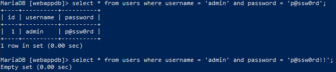
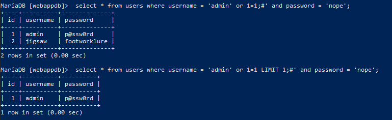
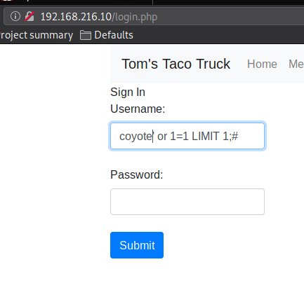
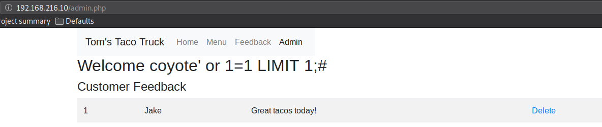
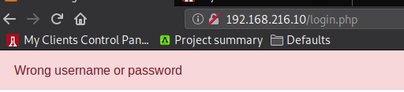
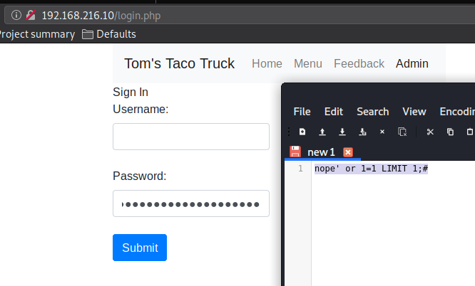
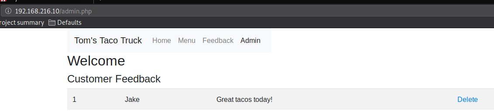

### 9.4.5.4 Exercises
#### 1. Interact with the MariaDB database and manually execute the commands required to authenticate to the application. Understand the vulnerability.

- A normal query as it would be passed with correct and incorrect login info:
  
- When we inject our text, it bypasses the login check:
  

#### 2. SQL inject the username field to bypass the login process.

#### 3. Why is the username displayed like it is in the web application once the authentication process is bypassed?

Because it is displaying the value we supplied for 'username' on the front page, including our injection code.

#### 4. Execute the SQL injection in the password field. Is the “LIMIT 1” necessary in the payload? Why or why not?

- Without LIMIT 1:
  
  
- With LIMIT 1:
  
  

LIMIT 1 is necessary, because without it, we still get two records and fail the check that comes after the query.

