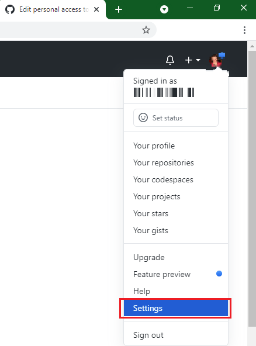
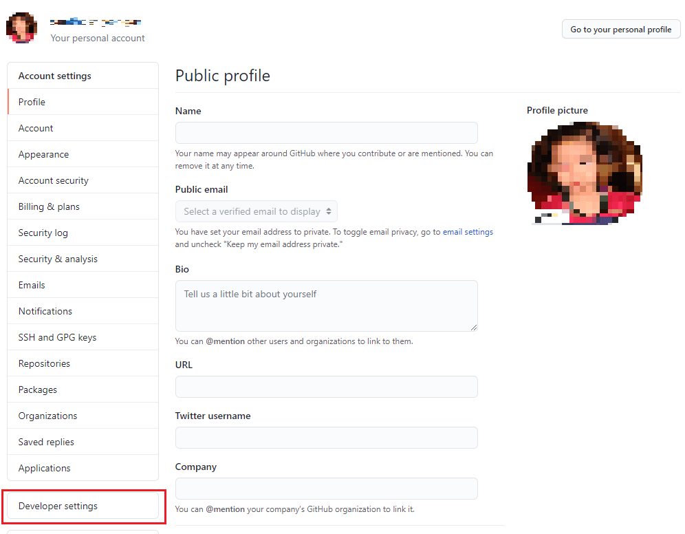
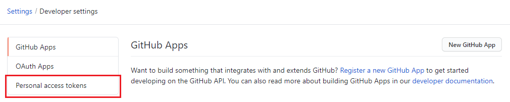
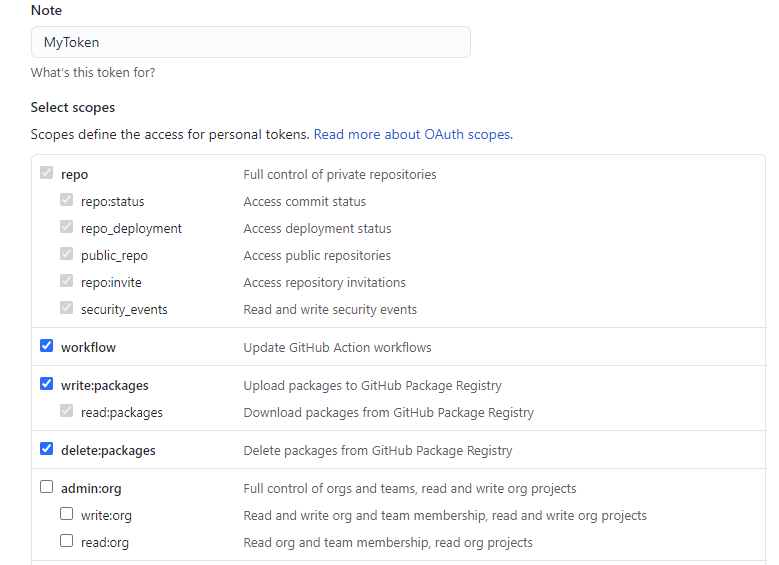

# Getting Files From Repository

## Clone a repository

This will create a .git file in the folder and download the current contents of the repository into the folder

```bash
git clone git@github.com:whatever folder-name

#ex: If it's public, no username is needed
git clone https://github.com/msu-cnm/cnm352-documenatation.git /home/kali/Documents/cnm352
```

## Update Local Repository

After a repository is cloned, it can be updated with this command.

Note:  If any files were changed locally, this will fail unless you run the reset command

```bash
# If you want to discard all changes locally, reset first:
# git -C FOLDER_NAME reset --hard BRANCH_NAME

# To update it from outside the folder
git -C FOLDER_NAME pull # If scripting, make sure NOT to use the ~, only use absolute paths

# To update from within the folder
git pull
```

## Discard Local Changes

### All Changes

```bash
# Reverts local changes to tracked files, but doesn't remove added files/folders
git -C FOLDER_NAME reset --hard BRANCH_NAME

# Remove all untracked files and directories.
# '-f' is force, '-d' is remove directories.
git clean -fd
```

### Specific Locations

```bash
git restore --source=HEAD --staged --worktree -- RelativeDir
# or, shorter
git restore -s@ -SW  -- aDirectory

# Example of restoring the scripts folder in a git local repo directory
git -C LOCALREPODIR restore --source=main --staged --worktree -- scripts
```

# Sending Changes to Repository

## Create a token on GitHub

1. Log in to GitHub and navigate to the `Settings` page as shown below:



2. Click on `Developer Settings`



3. Click on Personal Access Tokens



4. Click on `Generate new token`


5. Now type in the name of the token and select the scopes, or  permissions, you’d like to grant this token. Make sure you select repo  to use your token to access repositories from the command line. Click `Generate` token.



Note:  Make sure to copy your personal access token immediately. You won’t be able to see it again!

## Commit Changes Locally

If any files were added, these need to be tracked using the `add` keyword:

```bash
# You can specify individual files or specify all files with a wildcard
git add *
```

You can do this two ways:

Commit message in VIM:

```bash
git commit
# You will be taken to VIM, where you need to add your message
```

Predefined simple commit message

```bash
git commit -am "My Commit Message"
```

## Push Changes to Remote Repo

For a newly cloned repo, you need to setup author information:

```bash
C:\Dropbox\Apps\PortableGit\bin\git config --global user.email "msu.cnm@murraystate.edu"
C:\Dropbox\Apps\PortableGit\bin\git config --global user.email "b.dixon"
```

Use the token created above:

```bash
# Note the Username field is just the regular username you see in the Github URL, not your email address
git push https://<GITHUB_ACCESS_TOKEN>@github.com/<GITHUB_USERNAME>/<REPOSITORY_NAME>.git
```


